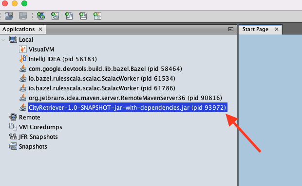

# App #4: "The Lightweight City Retriever" :city_sunrise:

The Lightweight City Retriever application allows you to get information on any city you'd like, and fast!
It introduces a revolutionary cache mechanism that will save you plenty of time and network latency.

When a request for a city arrives, first we'll check if it exists in the cache. If it is still not in the cache, 
we'll call our remote and slow DB, cache the city and return it.

To test that it is working properly, let's fire up the server and see what happens

## :computer: Running locally 

1. In your terminal navigate to `CityRetriever` folder, located in the root of this repository.  
Execute `./compile.sh` and `./run.sh`. Your Jetty server should be up and running.

## :mag_right: Gathering evidence

2. In a separate terminal window, locate your PID via `jps`.

3. Open Visualvm (can be found in your Mac's "Applications" or "Launchpad"), locate your app and go to the `Monitor` tab.  

4. Run `./create_load.sh` from a new terminal window. It will create 6K requests. 
Each request will try to retrieve one of the first 10 cities (So eventually there should be no more than 10 cities in our cache)

5. Back to VisualVM. You should see the Heap graph going wild. It might take a while to be reflected.  

To investigate further, let's take a heap dump. In JVisualVM: `Monitor` tab -> `Heap dump` (right upper corner). 
Let's open the heap dump and look at the `Objects` tab. What is wrong here? (Look for the `City` instances..)

6. Kill the app. 

## :boom: Creating even more load!

7. What will happen if we keep firing requests?  

Let's simulate what will happen over time, by infinitely fetching the first 10 cities.    
Run `./fast_run.sh` - It will do that for you and will crash your app.

## :hammer: Fixing the issue  

8. Open the source code in your favorite IDE (load the `CityRetriever/pom.xml`).  
Locate and try to fix the problem.  

9. Compile and run again to make sure the problem is solved.

Solution [is here](solution/Solution.md)

## Aaaand, we're done. Thank you for participating in the JVM Workshop!
